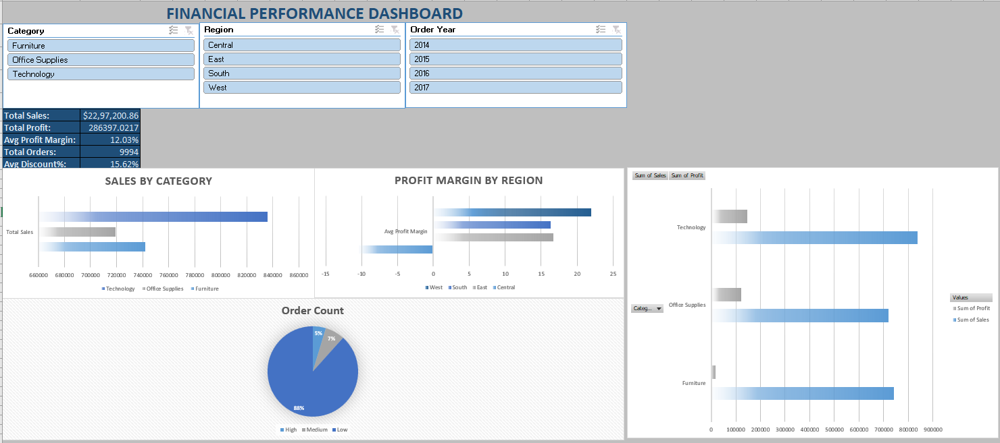
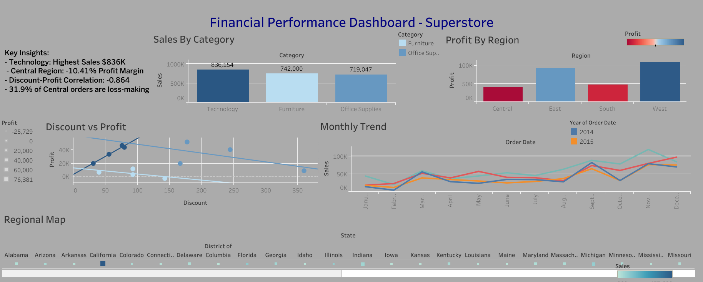

# 📊 Financial Sales Performance Analytics — End to End Project


---

## 📌 Project Overview

End-to-end financial sales analytics on **9,994 retail transactions** from the Superstore dataset — uncovering key drivers of profitability, regional performance gaps, and discount impact using Excel, Python, Tableau and Power Automate.

```
Layer 1 — Advanced Excel
    → Power Query cleaning, SUMIF, AVERAGEIF, INDEX MATCH, 
      CORREL, Pivot Tables, Interactive Dashboard
            ↓
Layer 2 — Python (Pandas, NumPy, Matplotlib)
    → Statistical analysis, correlation, forecasting, visualizations
            ↓
Layer 3 — Tableau
    → Interactive dashboard published on Tableau Public
            ↓
Layer 4 — Power Automate
    → Automated email reporting workflow
```

---

## 🎯 Business Questions Answered

| # | Business Question | Tool |
|---|---|---|
| 1 | Which category drives highest revenue? | Excel + Python + Tableau |
| 2 | Which region is most/least profitable? | Excel + Python + Tableau |
| 3 | Does discounting increase or decrease profit? | Python + Excel |
| 4 | What percentage of orders are loss-making? | Python |
| 5 | What is the monthly sales trend? | Python + Tableau |
| 6 | What are forecasted sales for next 6 months? | Python |
| 7 | Which customers generate highest revenue? | Tableau |
| 8 | How does geography affect sales performance? | Tableau |

---

## 📁 Project Structure

```
financial-sales-analytics/
│
├── 📂 data/
│   └── Sample - Superstore.csv              ← Raw dataset (Kaggle)
│
├── 📂 excel/
│   └── Financial_Performance_Dashboard.xlsx ← Complete Excel workbook
│
├── 📂 python/
│   ├── financial_analysis.py               ← Complete Python script
│   ├── financial_analysis_charts.png       ← 4 chart analysis
│   ├── monthly_trend.png                   ← Monthly trend chart
│   └── sales_forecast.png                  ← 6 month forecast chart
│
├── 📂 tableau/
│   └── dashboard_screenshot.png            ← Tableau dashboard
│
├── 📂 powerautomate/
│   └── flow_screenshot.png                 ← Automation flow
│
└── README.md
```

---

## 🛠️ Tools & Technologies

| Tool | Purpose |
|---|---|
| **Advanced Excel** | Power Query cleaning, SUMIF, AVERAGEIF, COUNTIF, INDEX MATCH, CORREL, Pivot Tables, Slicers |
| **Python — Pandas** | Data cleaning, groupby analysis, feature engineering |
| **Python — NumPy** | Statistical calculations, correlation, forecasting |
| **Python — Matplotlib** | Professional charts and visualizations |
| **Tableau Public** | Interactive dashboard, geographic map, published online |
| **Power Automate** | Automated email reporting workflow |

---

## 📊 Dataset

**Source:** [Superstore Sales Dataset — Kaggle](https://www.kaggle.com/datasets/vivek468/superstore-dataset-final)

| Property | Value |
|---|---|
| Rows | 9,994 transactions |
| Columns | 21 features |
| Period | 2014 — 2017 |
| Domain | Retail Sales |

---

## 📗 Layer 1 — Advanced Excel

### Data Cleaning — Power Query

**Challenge:** Date column had two mixed formats:
- `06-09-2014` — DD-MM-YYYY format
- `4/15/2017` — M/DD/YYYY format

**Solution — Custom M Language formula:**
```
if Text.Contains([Order Date], "/")
then Date.FromText([Order Date], [Format="M/d/yyyy", Culture="en-US"])
else Date.FromText([Order Date], [Format="dd-MM-yyyy", Culture="en-GB"])
```

### Calculated Columns Added:
- `Delivery Days` — shipping time per order
- `Order Year` — extracted from Order Date
- `Order Month` — extracted from Order Date
- `Profit Margin %` — Profit / Sales * 100
- `Sales Category` — High / Medium / Low classification

### Advanced Formulas Used:

**SUMIF — Total Sales by Category:**
```excel
=SUMIF('Clean Data'!E:E, A2, 'Clean Data'!T:T)
```

**AVERAGEIF — Profit Margin by Region:**
```excel
=AVERAGEIF('Clean Data'!K:K, D2, 'Clean Data'!Y:Y)
```

**COUNTIF — Orders by Sales Category:**
```excel
=COUNTIF('Clean Data'!Z:Z, A9)
```

**INDEX MATCH — Dynamic Order Lookup:**
```excel
=IFERROR(INDEX('Clean Data'!S:S, MATCH(B15,'Clean Data'!B:B,0)), "Not Found")
```

**CORREL — Discount vs Profit Correlation:**
```excel
=CORREL('Clean Data'!R:R, 'Clean Data'!S:S)
```

### Dashboard Features:
- ✅ 5 KPI Cards — Total Sales, Profit, Margin, Orders, Discount
- ✅ Bar Chart — Sales by Category
- ✅ Bar Chart — Profit Margin by Region
- ✅ Pie Chart — Order distribution by Sales Category
- ✅ 3 Interactive Slicers — Category, Region, Order Year
- ✅ 3 Pivot Tables connected to slicers

---

## 📸 Dashboard Preview



---

## 🐍 Layer 2 — Python Statistical Analysis

### Setup
```bash
pip install pandas numpy matplotlib seaborn
```

### Key Analysis Code:

**Correlation Analysis:**
```python
# Discount vs Profit Margin correlation
correlation = df['Discount'].corr(df['Profit Margin %'])
print(f"Correlation: {correlation:.3f}")  # Output: -0.864

# Full correlation matrix
corr_matrix = df[['Sales', 'Profit', 'Discount', 
                   'Quantity', 'Profit Margin %']].corr().round(3)
```

**Regional Discount Analysis:**
```python
discount_region = df.groupby('Region').agg(
    AvgDiscount=('Discount', 'mean'),
    AvgProfitMargin=('Profit Margin %', 'mean'),
    LossOrders=('Profit', lambda x: (x < 0).sum()),
    TotalOrders=('Profit', 'count')
).round(2).reset_index()

discount_region['LossRate%'] = (
    discount_region['LossOrders'] / 
    discount_region['TotalOrders'] * 100
).round(2)
```

**6 Month Sales Forecast:**
```python
# Linear trend forecasting using NumPy
coefficients = np.polyfit(x, y, 1)
trend_line = np.poly1d(coefficients)

future_index = range(len(x), len(x) + 6)
forecast = [trend_line(i) for i in future_index]
```

---

## 📈 Layer 3 — Tableau Dashboard

### Visuals Built:
- **Bar Chart** — Sales by Category
- **Bar Chart** — Profit Margin by Region (Red/Blue diverging)
- **Scatter Plot** — Discount vs Profit with trend line
- **Line Chart** — Monthly Sales Trend by Year
- **Geographic Map** — Regional Sales Heatmap
- **Bar Chart** — Top 10 Customers by Revenue

### Dashboard Features:
- ✅ Interactive filters — click any chart to filter all others
- ✅ Geographic heatmap
- ✅ Published on Tableau Public

🔗 **Live Dashboard:** [View on Tableau Public](#) ← add your URL

---

## 📸 Dashboard Preview



---

## ⚡ Layer 4 — Power Automate

### Flow Built:
**Sales Report Notification Flow**
- Trigger: Manual / Scheduled
- Action: Send email with KPI summary and dashboard link
- Eliminates manual reporting effort completely

---

## 🔍 Key Business Insights

| # | Insight | Impact |
|---|---|---|
| 1 | Technology drives highest revenue — **$836K (37% of total)** | Focus marketing on Technology |
| 2 | Central region has **-10.41% profit margin** — losing money | Immediate discount reduction needed |
| 3 | **88% of orders are low value** (under $500) | Strategy needed for high value deals |
| 4 | Discount vs Profit correlation — **-0.864** (very strong negative) | Discounting is the #1 profit killer |
| 5 | Central gives **24% average discount** vs West's **11%** | Central discounting is excessive |
| 6 | **31.9% of Central orders are loss-making** | Nearly 1 in 3 Central orders loses money |
| 7 | West region — **21.95% profit margin** with only 11% discount | West is the profitability benchmark |
| 8 | Sales forecast shows **$900/month growth** trend | Business on positive trajectory |

---

## 💡 Business Recommendations

1. **Reduce Central region discounts** from 24% to 15% (East/South level) — would eliminate negative profit margin
2. **Cap maximum discount at 20%** across all regions — correlation of -0.864 proves discounts beyond this destroy profitability
3. **Focus on Technology category** — highest revenue and strong profit margins
4. **Replicate West region strategy** — lowest discounts, highest profitability model

---

## 🚀 How to Run

### Excel:
1. Download `Sample - Superstore.csv`
2. Open `Financial_Performance_Dashboard.xlsx`
3. Refresh Power Query connections
4. All formulas and charts update automatically

### Python:
```bash
pip install pandas numpy matplotlib seaborn
cd python
python financial_analysis.py
```

### Tableau:
> Open Tableau Public
> Connect to `Sample - Superstore.csv`
> Or view live dashboard at Tableau Public URL - https://public.tableau.com/app/profile/deeksha.gupta5372/viz/Book1_17780127772900/FinancialPerformanceDashboard?publish=yes

---

## 👩‍💻 Author

**Deeksha Gupta**
- 💼 Data Analyst | Power BI Developer
- 🏆 Microsoft PL-300 Certified
- 📧 deeksha513g@gmail.com
- 🔗 [LinkedIn](https://www.linkedin.com/in/deeksha-gupta)
- 🐙 [GitHub](https://github.com/deekshadggupta-a11y)

---

⭐ **If you found this project helpful, please give it a star!**
